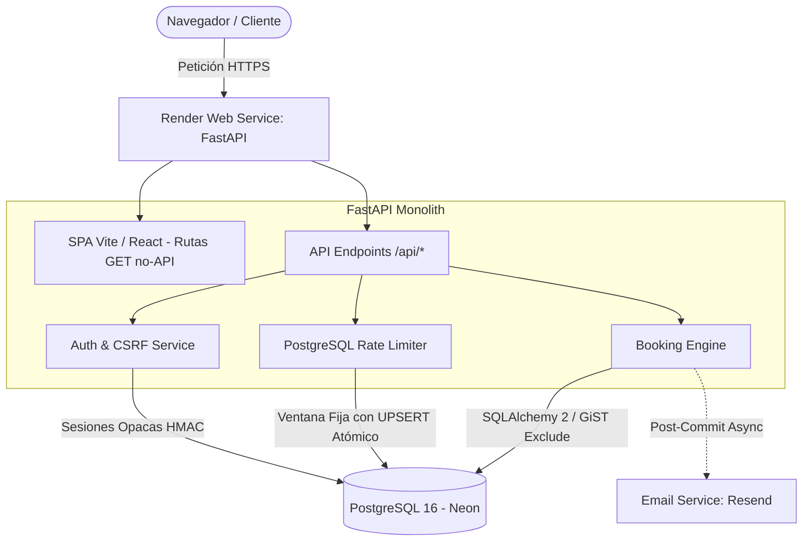

# Sistema de Reservas & Gestión para Negocios por Cita

[](https://github.com/javier-tralma/motor-de-reservas/actions/workflows/ci.yml)


MVP profesional de reservas en línea y gestión operativa diseñado para negocios de servicios por cita (estudios de belleza, barberías, centros de salud o consultorías). Implementado con foco prioritario en **corrección de dominio**, **consistencia de concurrencia** y **experiencia de usuario**.

Demostración técnica configurada con datos para el negocio ficticio **Estudio Nómada** (Viña del Mar, Chile).

---

## Estado del Despliegue & Demostración Pública

> [!NOTE]
> **Estado de Despliegue:** La preparación del repositorio para despliegue unificado (same-origin) en Render y Neon Free está terminada. La URL pública de demostración y las capturas de portfolio se añadirán una vez aprovisionadas las credenciales del proveedor y verificado el dominio DNS en Resend.
>
> **Límites de Infraestructura Gratuita:** Al desplegarse en niveles gratuitos (Render Free Web Service y Neon Free PostgreSQL), los servicios entran en reposo tras periodos de inactividad. La primera solicitud tras un periodo de inactividad puede experimentar una latencia de arranque en frío (*cold start*) y tardar aproximadamente un minuto tras inactividad mientras las instancias despiertan.

---

## Características Principales

### Experiencia Pública (Cliente)
- **Flujo de Reserva Mobile-First**: Asistente por pasos sin calendarios complejos en móviles, permitiendo seleccionar servicio, profesional (o «Cualquier profesional» determinista), fecha y bloque horario.
- **Cálculo de Disponibilidad en Tiempo Real**: Horarios calculados en servidor considerando reglas semanales, duraciones, descansos, bloqueos de tiempo (*time off*) y margen mínimo de aviso (120 min).
- **Idempotencia de Creación**: Protección contra doble clic y pérdidas de conexión mediante claves de idempotencia únicas (`client_request_id`).
- **Confirmación con Snapshot Histórico**: Pantalla de éxito con resumen completo, precio y duración congelados al momento de reservar.

### Panel de Administración (Gestión Operativa)
- **Dashboard Operativo**: Métricas del día, próximas citas y alertas de agenda.
- **Agenda & Calendario Interactivo**: Visualización semanal y por lista de reservas con soporte de FullCalendar, filtrado por profesional y estados (`confirmed`, `completed`, `cancelled`, `no_show`).
- **Catálogo de Servicios y Profesionales**: Modificación de duraciones, precios, orden y asignaciones de servicio por profesional.
- **Configuración de Horarios & Bloqueos**: Definición de bloques laborales semanales y programación de ausencias/capacitaciones (*time off*).
- **Creación de Citas Manuales**: Reserva interna rápida para clientes presenciales o telefónicos.

---

## Decisiones Técnicas & Arquitectura



### 1. Garantía Absoluta contra Doble Reserva (Exclusión GiST)
Para evitar que dos clientes reserven simultáneamente el mismo bloque con un mismo profesional, la base de datos PostgreSQL impone una restricción de exclusión mediante extensión `btree_gist`:

```sql
ALTER TABLE bookings ADD CONSTRAINT bookings_provider_no_overlap
EXCLUDE USING gist (
  provider_id WITH =,
  tstzrange(starts_at, ends_at, '[)') WITH &&
)
WHERE (status != 'cancelled');
```
Cualquier colisión concurrente es resuelta a nivel de motor de almacenamiento y traducida por la API como `409 slot_unavailable`.

### 2. Arquitectura Same-Origin (Resolución de Public Suffix)
El dominio `onrender.com` forma parte de la *Public Suffix List*. Para evitar que los navegadores bloqueen cookies administrativas `SameSite=Lax` entre subdominios distintos, el backend FastAPI empaqueta y sirve directamente los archivos compilados de la SPA de Vite:
- Peticiones `/api/*` son gestionadas por los routers de FastAPI.
- Peticiones `/health`, `/docs`, `/openapi.json` se sirven directamente.
- Peticiones GET a rutas de frontend (ej. `/admin/dashboard`, `/reservar`) retornan `index.html` para permitir el enrutamiento del lado del cliente y refrescos directos.
- Consulta [ADR 002: Despliegue Same-Origin](docs/decisions/002-same-origin-deployment.md).

### 3. Autenticación Administrativa mediante Sesiones Opacas
En lugar de tokens JWT en `localStorage`, la autenticación utiliza sesiones opacas persistentes en PostgreSQL:
- Token aleatorio de 256 bits almacenado en cookie con flags `HttpOnly`, `SameSite=Lax` y `Secure` (en producción).
- La base de datos almacena exclusivamente el HMAC-SHA-256 del token con `SESSION_SECRET`.
- Revocación inmediata y protección CSRF mediante validación de `Origin` header en peticiones mutativas.
- Consulta [ADR 001: Autenticación Administrativa](docs/decisions/001-admin-session-auth.md).

### 4. Rate Limiting Atómico en PostgreSQL
Protección contra abusos y ataques de fuerza bruta en endpoints públicos y login administrativo mediante un algoritmo de **ventana fija** con UPSERT atómico en PostgreSQL y hash HMAC de IP, evitando desincronización de estado o dependencias de almacenamiento en memoria externa.

---

## Stack Tecnológico

| Capa | Tecnologías |
| :--- | :--- |
| **Backend** | Python 3.14, FastAPI, SQLAlchemy 2 (Core + ORM), Pydantic v2, Alembic, uv |
| **Base de Datos** | PostgreSQL 16 (`btree_gist`, `timestamptz`, constraints de rango) |
| **Frontend** | React 19, TypeScript, Vite, Tailwind CSS, TanStack Query, React Hook Form, Zod |
| **Seguridad** | Argon2id, HMAC-SHA-256, Cookies HttpOnly host-only, Origin validation |
| **Integraciones** | Resend API (`EmailService`), FullCalendar |
| **Testing** | Pytest, Vitest, Testing Library, Playwright (E2E), Ruff |
| **Infraestructura** | Docker Compose (Local), Render Free Web Service + Neon Free (Producción), GitHub Actions (CI) |

---

## Ejecución Local

### Prerrequisitos
- [Docker](https://www.docker.com/) & Docker Compose
- [uv](https://docs.astral.sh/uv/) (administrador de paquetes Python)
- [Node.js](https://nodejs.org/) v24+ y npm

### 1. Iniciar Base de Datos PostgreSQL
```bash
docker compose up -d
```
Esto levantará PostgreSQL 16 en los puertos:
- `5432`: Base de desarrollo (`booking_db`)
- `5433`: Base de tests automatizados (`booking_test`)
- `5434`: Base de pruebas E2E (`booking_e2e`)

### 2. Configurar Variables de Entorno
```bash
cp .env.example .env
```
*(Editar `.env` según sea necesario; los valores por defecto funcionan directamente con Docker Compose).*

### 3. Backend (FastAPI)
```bash
cd backend
uv sync
uv run alembic upgrade head
uv run python scripts/seed.py
uv run uvicorn app.main:app --reload --port 8000
```
- API pública y endpoints: `http://localhost:8000/api`
- Documentación interactiva Swagger: `http://localhost:8000/docs`

### 4. Frontend (Vite)
En una terminal separada:
```bash
cd frontend
npm install
npm run dev
```
- Aplicación de desarrollo: `http://localhost:5173`

---

## Verificación & Suite de Pruebas

El repositorio cuenta con una suite completa de pruebas unitarias, de integración y end-to-end:

```bash
# Backend (Lint, Formato y Pytest con PostgreSQL real)
cd backend
uv run ruff check .
uv run ruff format --check .
PYTHONPATH=. uv run pytest

# Frontend (Lint, Tipos y Vitest)
cd frontend
npm run lint
npm run typecheck
npm run test -- --run

# Pruebas End-to-End (Playwright con Chromium aislado en booking_e2e)
npm run e2e
```

---

## Despliegue en Producción (Render + Neon)

El repositorio incluye el Blueprint [render.yaml](render.yaml) preparado para despliegue automatizado con `rootDir: backend`.

### Comandos de Construcción y Ejecución
- **Build Command:**
  ```bash
  cd ../frontend && npm ci && npm run build && cd ../backend && uv sync --frozen --no-dev
  ```
- **Start Command:**
  ```bash
  uv run alembic upgrade head && uv run python scripts/seed.py && uv run uvicorn app.main:app --host 0.0.0.0 --port $PORT
  ```

### Variables de Entorno de Producción Requeridas
Configurar en el panel de Render o proveedor externo:
- `APP_ENV`: `production`
- `DATABASE_URL`: URL de conexión PostgreSQL de Neon con el formato requerido por SQLAlchemy y psycopg 3 (`postgresql+psycopg://...`). Debe conservar obligatoriamente el parámetro `sslmode=require` para la conexión cifrada a Neon.
- `BUSINESS_ID`: UUID del negocio principal.
- `FRONTEND_URL`: URL pública asignada (ej. `https://booking-sistema.onrender.com`).
- `SESSION_SECRET`: Clave aleatoria de 32+ bytes para hash de sesiones.
- `RATE_LIMIT_SECRET`: Clave aleatoria de 32+ bytes para rate limiting.
- `EMAIL_PROVIDER`: `resend` *(requiere dominio verificado en Resend)*.
- `RESEND_API_KEY`: Clave de API de Resend.
- `EMAIL_FROM`: Dirección de remitente verificada (ej. `reservas@tudominio.com`).
- `ADMIN_EMAIL`: Correo del administrador para el seed inicial.
- `ADMIN_PASSWORD`: Contraseña segura del administrador.
- `ADMIN_DISPLAY_NAME`: Nombre visible del administrador.

---

## Alcance & Fuera de Alcance (Roadmap P2)

Para mantener la robustez y foco del MVP, se definieron límites deliberados de alcance:

- **Incluido (P0/P1)**: Reservas públicas, selección de profesional o asignación determinista, exclusión de solapes, confirmación por email, panel administrativo, gestión de catálogo, horarios semanales, ausencias/bloqueos, citas manuales y rate limiting.
- **Fuera de Alcance (P2)**: Pasarelas de pago, multi-negocio visible por subdominio, recordatorios por WhatsApp, sincronización bidireccional con Google Calendar y cuentas de usuario cliente.
