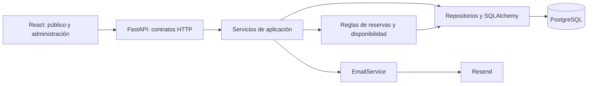
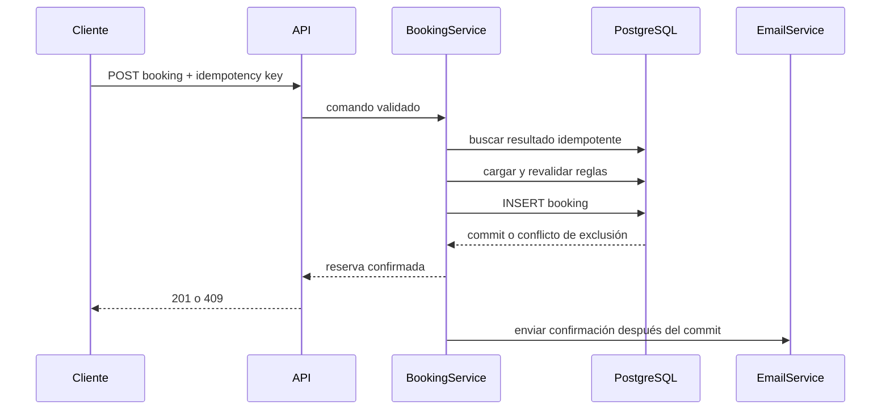

# Arquitectura

## 1. Contexto y restricciones

Este repositorio contiene una aplicación web de reservas para una sola instalación de negocio. El diseño conserva `business_id` en datos, servicios y autorización para facilitar multi-tenancy futuro, pero P0 ejecuta con un único `BUSINESS_ID` configurado o resuelto desde la instalación.

La arquitectura busca una aplicación modular, no microservicios. Frontend, API y PostgreSQL se despliegan como unidades separables; toda la lógica de negocio crítica vive en el backend.

Fuentes de verdad:

- [docs/PRODUCT.md](docs/PRODUCT.md): alcance, flujos y aceptación.
- [docs/DATA_MODEL.md](docs/DATA_MODEL.md): persistencia e invariantes de datos.
- [docs/DESIGN.md](docs/DESIGN.md): experiencia e interfaz.
- [AGENTS.md](AGENTS.md): reglas de trabajo para agentes.
- [.agents/skills/booking-domain/SKILL.md](.agents/skills/booking-domain/SKILL.md): procedimiento para cambios del dominio de reservas.

## 2. Stack acordado

### Frontend

- React + TypeScript + Vite.
- React Router para rutas.
- TanStack Query para estado remoto, caché e invalidación.
- React Hook Form + Zod para formularios y validación de entrada.
- Tailwind CSS con tokens CSS para estilos.
- FullCalendar solamente en el panel administrativo.
- Vitest + Testing Library; Playwright para E2E.

### Backend

- Python + FastAPI.
- Pydantic para contratos HTTP y configuración.
- SQLAlchemy 2 para persistencia.
- PostgreSQL como base de datos soportada.
- Alembic para migraciones.
- Argon2id mediante una biblioteca mantenida para contraseñas.
- Pytest para unitarios e integración.
- Ruff para lint y formato; comprobación estática de tipos según la configuración del proyecto.

### Integraciones

- Resend detrás de `EmailService`.
- En desarrollo y tests, `ConsoleEmailService` o `FakeEmailService` sin llamadas de red.

No añadir Redux, un framework de inyección complejo, colas, microservicios ni un segundo ORM sin una decisión de arquitectura aprobada.

## 3. Estructura del repositorio

```text
booking-system/
├── frontend/
│   ├── src/
│   │   ├── app/                 # router, providers y shell
│   │   ├── components/          # primitivas compartidas
│   │   ├── features/
│   │   │   ├── public-booking/
│   │   │   ├── admin-bookings/
│   │   │   ├── services/
│   │   │   ├── providers/
│   │   │   ├── availability/
│   │   │   └── auth/
│   │   ├── lib/                 # cliente HTTP, fechas y utilidades
│   │   └── styles/
│   └── tests/
├── backend/
│   ├── app/
│   │   ├── api/
│   │   │   ├── public/
│   │   │   └── admin/
│   │   ├── core/                # config, seguridad, errores, logging
│   │   ├── db/                  # sesión y metadata
│   │   ├── models/
│   │   ├── schemas/
│   │   ├── repositories/        # consultas no triviales, sin reglas
│   │   ├── services/            # casos de uso y reglas de negocio
│   │   ├── integrations/email/
│   │   └── main.py
│   ├── alembic/
│   └── tests/
│       ├── unit/
│       └── integration/
├── docs/                        # ADR y documentación adicional futura
├── .agents/skills/
├── docker-compose.yml
├── .env.example
└── AGENTS.md
```

La estructura puede crecer por funcionalidad. No crear una capa si solo reenvía llamadas sin aislar una responsabilidad real.

## 4. Límites y dependencias



Reglas de dependencia:

- Los componentes React no contienen reglas de disponibilidad.
- Los handlers FastAPI validan contratos, resuelven dependencias y traducen errores; no implementan casos de uso.
- Los servicios coordinan transacciones y reglas.
- Los repositorios encapsulan consultas complejas, no decisiones de negocio.
- Los modelos ORM no se devuelven directamente por HTTP.
- La integración con Resend no se importa fuera de `integrations/email`.
- El dominio recibe un reloj y configuración explícitos; no llama directamente a la hora del sistema en tests.

## 5. Contexto de negocio

P0 resuelve el negocio activo desde configuración. Aun así:

- todo repositorio recibe `business_id`;
- toda consulta sobre datos de tenant lo filtra;
- toda relación se valida dentro del mismo negocio;
- el cliente público no puede elegir ni enviar un `business_id` arbitrario;
- el admin autenticado queda asociado a un negocio.

La futura resolución por hostname o sesión se implementará en el borde sin cambiar las firmas internas principales.

## 6. Contratos HTTP

Base: `/api` y JSON. Fechas de calendario usan `YYYY-MM-DD`; instantes usan ISO 8601 con offset en respuestas. El backend convierte a UTC al persistir.

### Público

```text
GET  /api/public/business
GET  /api/public/services
GET  /api/public/services/{service_id}/providers
GET  /api/public/availability?service_id=&date=&provider_id=
POST /api/public/bookings
GET  /api/public/bookings/{public_reference}/confirmation
```

`provider_id` es opcional en disponibilidad y creación. Si se omite, la API devuelve slots agregados y asigna un profesional determinísticamente al confirmar.

`POST /bookings` acepta una clave de idempotencia en header o un `client_request_id` UUID generado por el frontend. No acepta `ends_at`, precio, duración ni estado.

### Administración

```text
POST   /api/admin/auth/login
POST   /api/admin/auth/logout
GET    /api/admin/auth/me
GET    /api/admin/dashboard
GET    /api/admin/bookings
GET    /api/admin/bookings/{id}
PATCH  /api/admin/bookings/{id}/status
GET    /api/admin/services
POST   /api/admin/services
PATCH  /api/admin/services/{id}
GET    /api/admin/providers
POST   /api/admin/providers
PATCH  /api/admin/providers/{id}
PUT    /api/admin/providers/{id}/services
GET    /api/admin/providers/{id}/availability-rules
PUT    /api/admin/providers/{id}/availability-rules
GET    /api/admin/time-off
POST   /api/admin/time-off
DELETE /api/admin/time-off/{id}
```

Los endpoints de reserva manual se incorporan en P1.

### Errores

Formato estable:

```json
{
  "error": {
    "code": "slot_unavailable",
    "message": "Ese horario acaba de dejar de estar disponible.",
    "details": {},
    "request_id": "..."
  }
}
```

- `400`: solicitud semánticamente inválida.
- `401`/`403`: sesión ausente o acción no permitida.
- `404`: recurso inexistente dentro del negocio actual.
- `409`: conflicto de disponibilidad, idempotencia o transición.
- `422`: contrato de entrada inválido.
- `500`: error inesperado sin detalles internos.

Usar códigos de máquina estables; el frontend no decide por texto humano.

## 7. Motor de disponibilidad

Firma conceptual:

```python
get_available_slots(
    *,
    business_id: UUID,
    service_id: UUID,
    local_date: date,
    provider_id: UUID | None,
    now: datetime,
) -> list[AvailableSlot]
```

Procedimiento:

1. Cargar negocio y servicio activo.
2. Validar fecha contra anticipación mínima y horizonte.
3. Resolver profesionales activos que ofrecen el servicio.
4. Interpretar reglas del día en la zona IANA del negocio.
5. Generar comienzos candidatos según `slot_interval_minutes`.
6. Calcular cada final desde `duration_minutes`.
7. Mantener solamente candidatos contenidos por completo en una regla.
8. Cargar reservas no canceladas y bloqueos que intersecten la ventana consultada.
9. Excluir cualquier candidato que solape esos intervalos.
10. Devolver instantes con offset local, ordenados por inicio y profesional.

Comparación de solape para intervalos semiabiertos:

```text
candidate_start < occupied_end AND occupied_start < candidate_end
```

No generar primero un día UTC de 24 horas. Construir los límites desde fecha y hora locales con `zoneinfo`, porque los cambios de horario pueden producir días de distinta duración o horas ambiguas/inexistentes. Definir y testear la política de ambigüedad antes de aceptar reglas en una hora afectada.

Para «Cualquier profesional», agrupar por `(starts_at, ends_at)` y conservar internamente la lista ordenada de profesionales elegibles. La asignación usa orden estable —por ejemplo `provider.id`— dentro de la transacción. No prometer optimización de carga en P0.

## 8. Creación transaccional y concurrencia

La creación sigue esta secuencia:



La protección tiene capas complementarias:

1. Revalidación de aplicación para mensajes comprensibles.
2. Transacción corta alrededor de selección e inserción.
3. Restricción de exclusión GiST en PostgreSQL sobre `provider_id` y `tstzrange(starts_at, ends_at, '[)')` para estados distintos de `cancelled`.
4. Restricción única por negocio y clave de idempotencia.

La API captura la violación conocida de exclusión y la traduce a `409 slot_unavailable`. No reintenta asignando silenciosamente otro horario. Si «Cualquier profesional» tiene más candidatos para el mismo slot, puede intentar el siguiente profesional dentro de un límite pequeño y determinista; el horario solicitado nunca cambia.

## 9. Transacciones y persistencia

- Una sesión SQLAlchemy por petición o caso de uso en background.
- El servicio de aplicación controla `commit` y `rollback`; los repositorios no hacen commits ocultos.
- No ejecutar llamadas a Resend dentro de una transacción abierta.
- Toda modificación de esquema requiere migración Alembic revisable y reversible cuando sea razonable.
- No editar migraciones ya aplicadas en entornos compartidos; crear una nueva.
- Usar constraints e índices descritos en `DATA_MODEL.md`, además de validación de Pydantic.

## 10. Autenticación y seguridad

- No existe registro público de administradores.
- Crear el administrador inicial mediante seed o comando de gestión seguro.
- Guardar solamente hash Argon2id, nunca contraseñas ni tokens en texto plano.
- Preferir una sesión o access token corto en cookie `HttpOnly`, `Secure` en producción y `SameSite=Lax`; no guardar credenciales en `localStorage`.
- Proteger operaciones mutables con política de origen/CSRF coherente con el despliegue.
- CORS usa una allowlist explícita.
- Aplicar rate limiting en login y creación pública en el borde o API antes de producción.
- Normalizar email para búsqueda, pero conservar una versión de presentación si es necesario.
- No revelar si un email administrativo existe.
- Validar límites de longitud y rechazar HTML no requerido en notas.
- Los secretos provienen del entorno y nunca se incluyen en logs o repositorio.

## 11. Email

Contrato mínimo:

```python
class EmailService(Protocol):
    def send_booking_confirmation(self, booking: BookingEmailData) -> EmailResult: ...
```

Reglas:

- Persistir y confirmar la reserva antes de enviar.
- Renderizar desde un DTO; no entregar un modelo ORM a la plantilla.
- Incluir servicio, profesional, fecha, hora, negocio y contacto.
- Presentar fecha y hora en `America/Santiago`.
- Registrar éxito o fallo con identificador del proveedor, sin loguear el cuerpo ni datos personales completos.
- Un fallo actualiza el estado de entrega a `failed` y genera visibilidad operativa; no cancela la reserva.
- Tests usan un fake determinista.

P0 puede despachar en una tarea posterior a la respuesta si el hosting lo soporta, pero no debe fingir garantías durables. Una cola/outbox con reintentos pertenece a una decisión posterior.

## 12. Estrategia frontend

- Organizar por feature; compartir primitivas visuales, no estados globales accidentales.
- TanStack Query posee datos remotos. Estado efímero del wizard queda local o en un contexto acotado.
- La URL conserva, cuando aporte, fecha, vista y filtros administrativos.
- Zod valida formularios en cliente para feedback; el backend sigue siendo autoridad.
- Invalidar queries afectadas después de mutaciones: reservas, dashboard y disponibilidad.
- Al recibir `409 slot_unavailable`, conservar datos personales, volver al paso de horario, refrescar slots y explicar el conflicto.
- No almacenar datos personales del formulario en almacenamiento persistente del navegador.
- Centralizar formateo de fecha, hora y CLP con `Intl`, usando locale `es-CL` y la zona del negocio.

## 13. Observabilidad y configuración

Variables esperadas, sin valores secretos en documentación:

```text
APP_ENV
DATABASE_URL
BUSINESS_ID
FRONTEND_ORIGIN
SESSION_SECRET
RESEND_API_KEY
EMAIL_FROM
LOG_LEVEL
```

Cada petición recibe `request_id`. Logs estructurados incluyen acción, resultado, latencia e identificadores internos; enmascaran email y teléfono. Registrar por separado conflictos esperados y errores inesperados.

Checks mínimos:

- `/health/live`: proceso vivo, sin dependencias.
- `/health/ready`: conexión a base y migraciones compatibles.

## 14. Testing

### Unitarios

- Funciones de intervalos, granularidad y reloj.
- Motor de disponibilidad con matriz de bordes.
- Transiciones de estado.
- Conversión de zona horaria y snapshots.

### Integración con PostgreSQL real

- Constraints, relaciones y scoping por negocio.
- Exclusión de solapamientos.
- Idempotencia.
- Dos transacciones concurrentes.
- Endpoints públicos y administrativos críticos.

SQLite no sustituye estas pruebas porque no reproduce rangos, GiST ni concurrencia de PostgreSQL.

### Frontend

- Formularios, estados y recuperación ante `409`.
- Accesibilidad de selección de servicio, fecha y slot.
- Adaptadores de contratos HTTP.

### E2E

- Reserva pública completa.
- Login y cancelación administrativa.
- Slot liberado después de cancelar.
- Manejo visible de slot tomado durante la confirmación.

## 15. Decisiones diferidas

Requieren ADR antes de implementarse:

- multi-tenancy visible y row-level security;
- cola/outbox para notificaciones;
- asignación inteligente de «Cualquier profesional»;
- sincronización con calendarios externos;
- pagos y estado `pending`;
- recursos adicionales, sucursales o capacidad mayor que uno.

