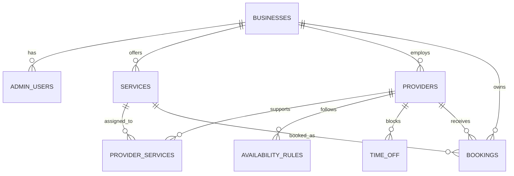
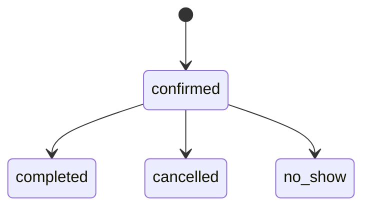

# Modelo de datos

## 1. Convenciones

- PostgreSQL es la base de datos de referencia.
- Claves primarias: UUID generados en servidor o base de datos.
- Cada tabla de negocio incluye `business_id`, aunque P0 tenga una sola instalación.
- Instantes: `timestamptz`, normalizados a UTC por la aplicación.
- Horas semanales: `time` sin zona; se interpretan en `business.timezone`.
- Fechas: `date` cuando representan un día civil, no un instante.
- Intervalos: semiabiertos `[starts_at, ends_at)`.
- Dinero CLP: entero en unidad mínima; por ejemplo `14000`, nunca `14000.00` ni `float`.
- Nombres de tablas y columnas: `snake_case`; enums con valores estables en minúsculas.
- Todas las tablas incluyen `created_at`; las mutables incluyen `updated_at`.
- No usar borrado en cascada para eliminar histórico de reservas.

La aplicación debe usar UUID en URLs y logs internos, pero entregar una `public_reference` aleatoria distinta para confirmaciones públicas.

## 2. Relaciones



`business_id` se repite deliberadamente en tablas hijas. Las migraciones deben impedir asociaciones entre negocios mediante claves foráneas compuestas o validación equivalente respaldada por constraints.

## 3. Enumeraciones

### `booking_status`

```text
confirmed
completed
cancelled
no_show
```

Solo `cancelled` libera capacidad. `completed` y `no_show` conservan el intervalo histórico como ocupado.

### `booking_source`

```text
public
admin
```

### `email_delivery_status`

```text
not_requested
pending
sent
failed
```

Una reserva pública nace con confirmación `pending`. Una manual nace obligatoriamente con `not_requested`.

## 4. Tablas

### 4.1 `businesses`

| Columna | Tipo | Reglas |
|---|---|---|
| `id` | `uuid` | PK |
| `name` | `varchar(120)` | no nulo |
| `slug` | `varchar(80)` | no nulo, único, minúsculas |
| `timezone` | `varchar(64)` | no nulo, default `America/Santiago`, identificador IANA válido |
| `locale` | `varchar(16)` | no nulo, default `es-CL` |
| `currency` | `char(3)` | no nulo, default `CLP` |
| `email` | `varchar(254)` | no nulo |
| `phone` | `varchar(32)` | nullable |
| `address` | `varchar(300)` | nullable |
| `minimum_booking_notice_minutes` | `integer` | no nulo, default `120`, `>= 0` |
| `booking_horizon_days` | `integer` | no nulo, default `60`, `1..365` |
| `slot_interval_minutes` | `integer` | no nulo, default `15`, `1..120` |
| `created_at` | `timestamptz` | no nulo |
| `updated_at` | `timestamptz` | no nulo |

P0 no edita `timezone`, `locale` ni `currency` desde la UI. Cambiar zona horaria con reservas existentes requiere un flujo específico futuro.

### 4.2 `admin_users`

| Columna | Tipo | Reglas |
|---|---|---|
| `id` | `uuid` | PK |
| `business_id` | `uuid` | FK a negocio, no nulo |
| `email` | `varchar(254)` | no nulo, normalizado para unicidad |
| `password_hash` | `varchar(255)` | no nulo, Argon2id |
| `display_name` | `varchar(120)` | no nulo |
| `is_active` | `boolean` | no nulo, default `true` |
| `last_login_at` | `timestamptz` | nullable |
| `created_at` | `timestamptz` | no nulo |
| `updated_at` | `timestamptz` | no nulo |

Constraint único: `(business_id, email)`. Índice: `ix_admin_users_business_email` sobre `(business_id, lower(email))`.

### 4.2.1 `admin_sessions`

| Columna | Tipo | Reglas |
|---|---|---|
| `id` | `uuid` | PK |
| `business_id` | `uuid` | FK a negocio, no nulo |
| `admin_user_id` | `uuid` | FK a `admin_users (business_id, id)`, no nulo |
| `token_hash` | `varchar(128)` | no nulo, único, HMAC-SHA-256 |
| `expires_at` | `timestamptz` | no nulo |
| `revoked_at` | `timestamptz` | nullable |
| `created_at` | `timestamptz` | no nulo |

Constraints e índices:
- `ForeignKeyConstraint(["business_id", "admin_user_id"], ["admin_users.business_id", "admin_users.id"], ondelete="CASCADE")`
- `UniqueConstraint("token_hash", name="uq_admin_sessions_token_hash")`
- `Index("ix_admin_sessions_admin_user_revoked", "admin_user_id", "revoked_at")`
- `Index("ix_admin_sessions_expires_at", "expires_at")`


### 4.3 `services`

| Columna | Tipo | Reglas |
|---|---|---|
| `id` | `uuid` | PK |
| `business_id` | `uuid` | FK a negocio, no nulo |
| `name` | `varchar(120)` | no nulo |
| `description` | `text` | no nulo, default vacío |
| `duration_minutes` | `integer` | no nulo, `5..720` |
| `price_amount` | `integer` | no nulo, `>= 0` |
| `is_active` | `boolean` | no nulo, default `true` |
| `sort_order` | `integer` | no nulo, default `0` |
| `created_at` | `timestamptz` | no nulo |
| `updated_at` | `timestamptz` | no nulo |

Índice: `(business_id, is_active, sort_order)`.

Cambiar nombre, precio o duración solo afecta reservas futuras. Cada reserva guarda snapshots para preservar su historial.

### 4.4 `providers`

| Columna | Tipo | Reglas |
|---|---|---|
| `id` | `uuid` | PK |
| `business_id` | `uuid` | FK a negocio, no nulo |
| `name` | `varchar(120)` | no nulo |
| `email` | `varchar(254)` | nullable |
| `phone` | `varchar(32)` | nullable |
| `bio` | `text` | no nulo, default vacío |
| `is_active` | `boolean` | no nulo, default `true` |
| `sort_order` | `integer` | no nulo, default `0` |
| `created_at` | `timestamptz` | no nulo |
| `updated_at` | `timestamptz` | no nulo |

`Provider` representa a cualquier profesional o recurso individual con capacidad uno. Capacidad mayor que uno queda fuera de P0.

Índice: `(business_id, is_active, sort_order)`.

### 4.5 `provider_services`

| Columna | Tipo | Reglas |
|---|---|---|
| `business_id` | `uuid` | FK a negocio, no nulo |
| `provider_id` | `uuid` | FK a profesional del mismo negocio, no nulo |
| `service_id` | `uuid` | FK a servicio del mismo negocio, no nulo |
| `created_at` | `timestamptz` | no nulo |

PK compuesta: `(provider_id, service_id)`. Añadir índices con `business_id` para scoping y una garantía de que ambos extremos pertenecen al mismo negocio.

No se añaden duraciones o precios por profesional en P0. Si un futuro cliente lo requiere, será una extensión explícita de esta relación.

### 4.6 `availability_rules`

| Columna | Tipo | Reglas |
|---|---|---|
| `id` | `uuid` | PK |
| `business_id` | `uuid` | FK a negocio, no nulo |
| `provider_id` | `uuid` | FK a profesional del mismo negocio, no nulo |
| `weekday` | `smallint` | no nulo, `0..6`; lunes = 0 |
| `start_time` | `time` | no nulo |
| `end_time` | `time` | no nulo, `end_time > start_time` |
| `created_at` | `timestamptz` | no nulo |
| `updated_at` | `timestamptz` | no nulo |

Índice: `(business_id, provider_id, weekday, start_time)`.

Reglas:

- se permiten varios intervalos en un día para representar pausas;
- no se permiten intervalos que crucen medianoche en P0; dividirlos en dos días;
- los intervalos de un mismo profesional y día no pueden solaparse;
- se permiten intervalos adyacentes, aunque la UI debería normalizarlos cuando sea claro;
- la aplicación valida solapamientos al reemplazar el horario semanal dentro de una transacción.

Las reglas no incluyen fechas de vigencia en P0. Excepciones concretas se modelan con `time_off`.

### 4.7 `time_off`

| Columna | Tipo | Reglas |
|---|---|---|
| `id` | `uuid` | PK |
| `business_id` | `uuid` | FK a negocio, no nulo |
| `provider_id` | `uuid` | FK a profesional del mismo negocio, no nulo |
| `starts_at` | `timestamptz` | no nulo |
| `ends_at` | `timestamptz` | no nulo, `ends_at > starts_at` |
| `reason` | `varchar(240)` | nullable |
| `created_at` | `timestamptz` | no nulo |
| `updated_at` | `timestamptz` | no nulo |

Índice GiST o consulta equivalente para intersecciones por profesional e intervalo. Índice B-tree adicional: `(business_id, provider_id, starts_at)`.

Los bloqueos sí pueden cruzar medianoche y abarcar varios días. Los solapamientos entre bloqueos son válidos; no crean disponibilidad negativa adicional.

### 4.8 `bookings`

| Columna | Tipo | Reglas |
|---|---|---|
| `id` | `uuid` | PK |
| `business_id` | `uuid` | FK a negocio, no nulo |
| `service_id` | `uuid` | FK restrictiva a servicio del mismo negocio, no nulo |
| `provider_id` | `uuid` | FK restrictiva a profesional del mismo negocio, no nulo |
| `public_reference` | `varchar(64)` | no nulo, único, aleatorio y no secuencial |
| `client_request_id` | `uuid` | nullable, idempotencia del comando, siempre generado para reservas públicas, puede ser nulo para otros flujos |
| `request_fingerprint` | `varchar(64)` | nullable, hash SHA-256 en hexadecimal de campos semánticos |
| `customer_name` | `varchar(120)` | no nulo |
| `customer_email` | `varchar(254)` | no nulo |
| `customer_phone` | `varchar(32)` | no nulo |
| `customer_notes` | `text` | no nulo, default vacío, longitud limitada por API |
| `starts_at` | `timestamptz` | no nulo |
| `ends_at` | `timestamptz` | no nulo, `ends_at > starts_at` |
| `status` | `booking_status` | no nulo, default `confirmed` |
| `source` | `booking_source` | no nulo |
| `service_name_snapshot` | `varchar(120)` | no nulo |
| `duration_minutes_snapshot` | `integer` | no nulo, `> 0` |
| `price_amount_snapshot` | `integer` | no nulo, `>= 0` |
| `provider_name_snapshot` | `varchar(120)` | no nulo |
| `email_delivery_status` | `email_delivery_status` | no nulo |
| `email_provider_id` | `varchar(160)` | nullable |
| `email_sent_at` | `timestamptz` | nullable |
| `email_last_error_code` | `varchar(80)` | nullable, sin cuerpo ni PII |
| `cancelled_at` | `timestamptz` | nullable, coherente con estado |
| `completed_at` | `timestamptz` | nullable, coherente con estado |
| `no_show_at` | `timestamptz` | nullable, coherente con estado |
| `created_at` | `timestamptz` | no nulo |
| `updated_at` | `timestamptz` | no nulo |


Constraints e índices:

- único `(business_id, client_request_id)` cuando `client_request_id IS NOT NULL`. Esta constraint previene creaciones concurrentes duplicadas; si falla, la capa de servicio inspecciona el registro existente, compara su `request_fingerprint` atómicamente, y devuelve la reserva (idempotencia) o un conflicto.
- único `public_reference`;
- índice `(business_id, starts_at)` para agenda;
- índice `(business_id, provider_id, starts_at)` para calendario y disponibilidad;
- índice `(business_id, status, starts_at)` para filtros;
- check `ends_at > starts_at`;
- checks de coherencia para timestamps de estado cuando sea práctico;
- restricción de exclusión para impedir solapamientos activos.

La API pública nunca devuelve `id`, `business_id`, datos administrativos de email ni notas internas. `public_reference` permite recuperar solo un resumen limitado de confirmación.
Para creación manual, la reserva usa obligatoriamente `source='admin'` y `email_delivery_status='not_requested'`, y no envía email.

## 5. Prevención de doble reserva

Habilitar `btree_gist` y crear una exclusión equivalente a:

```sql
CREATE EXTENSION IF NOT EXISTS btree_gist;

ALTER TABLE bookings
ADD CONSTRAINT bookings_provider_no_overlap
EXCLUDE USING gist (
  provider_id WITH =,
  tstzrange(starts_at, ends_at, '[)') WITH &&
)
WHERE (status <> 'cancelled');
```

La expresión exacta de Alembic debe verificarse contra el enum y la versión de PostgreSQL del proyecto. La intención es innegociable:

- mismo profesional + intervalos solapados + estados no cancelados → rechazo;
- profesionales diferentes → permitido;
- intervalos adyacentes → permitido;
- una reserva cancelada → no bloquea.

Esta constraint es la garantía final. Un `SELECT` previo no reemplaza la protección porque dos transacciones pueden observar el mismo slot libre.

## 6. Integridad entre negocios

Para que `business_id` sea una preparación real y no decorativa:

1. Añadir `UNIQUE (business_id, id)` en tablas padre cuando una FK compuesta lo requiera.
2. Usar FKs compuestas como `(business_id, provider_id)` y `(business_id, service_id)` en tablas hijas.
3. Filtrar toda lectura y mutación por el negocio resuelto, no solo por `id`.
4. Devolver `404` ante un recurso de otro negocio; no revelar su existencia.
5. Incluir tests de integración que intenten asociaciones cruzadas.

Row-level security y resolución dinámica de tenant quedan diferidas, no descartadas.

## 7. Transiciones de estado



P0 no reabre reservas terminales. Si se comete un error administrativo, se registra una nueva reserva o una futura decisión de auditoría; no añadir transiciones implícitas.

Al cancelar:

- validar que el estado actual sea `confirmed`;
- asignar `status = cancelled` y `cancelled_at` en la misma transacción;
- invalidar consultas de agenda y disponibilidad.

## 8. Política de edición y borrado

- `businesses`: no se elimina desde la app.
- `admin_users`: desactivar.
- `services`: desactivar si tiene referencias.
- `providers`: desactivar si tiene referencias.
- `provider_services`: se puede eliminar; no altera snapshots históricos.
- `availability_rules`: se reemplazan transaccionalmente por profesional.
- `time_off`: se puede eliminar; registrar la acción en logs.
- `bookings`: nunca se elimina desde P0; se cancela.

Una futura auditoría persistente es P2. P0 debe conservar timestamps y logs operativos suficientes sin inventar un sistema de eventos incompleto.

## 9. Orden sugerido de migraciones

1. Extensión `btree_gist`, enums y `businesses`.
2. `admin_users`, `services`, `providers` y `provider_services`.
3. `availability_rules` y `time_off`.
4. `bookings`, índices, idempotencia y exclusión.
5. Seed idempotente separado de migraciones estructurales.

Cada migración debe tener prueba de upgrade en PostgreSQL limpio. La migración de exclusión debe probar también inserciones solapadas, adyacentes y canceladas.

